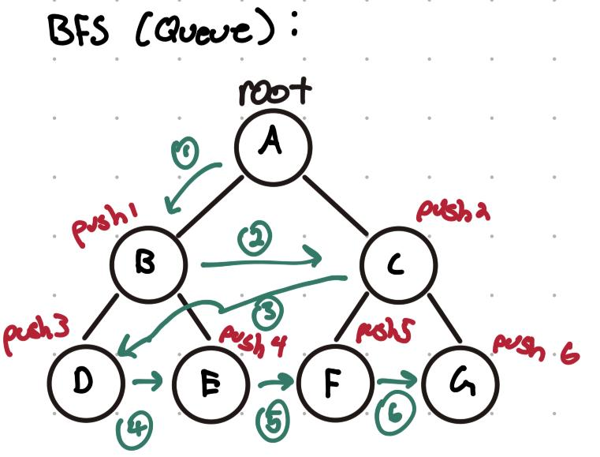
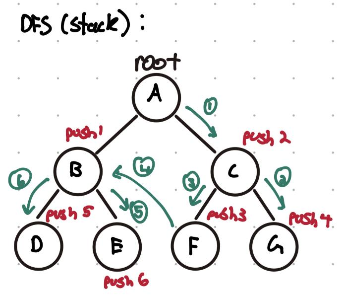

# Overview

In essence, a Tree data structure is a non-linear way of organizing data in a hierarchy. The structure of a tree consists of a root or parent node and their children nodes. Additionally, we have leaf nodes, which are the most recent children in the structure. This structure is widely used in file systems, databases, compilers, AI, networking, etc. for their efficient seraching, insertion and deletion. 

To make understaning trees easy, it is recommended to first start with BSTs (binary search trees) to familiarize yourself with how and why tree algorithms work, then move onto the more complex trees such as B-Trees. That being said, there are certain typical algorithms you see a lot in trees which we will cover here. 

# Tree Algorithms

## Traversal

Each tree has its own set of properties to follow in order to be classified as such, for example, a BST must follow the rules of a BST, a BTree must follow BTree rules, etc. For any tree, regardless of type, traversal can be accomplished in two ways

- iteration
- recursion

In reality, these methods are hardly unique to trees, but I stress them here for a particular reason...

For other structures, it is recommended to use the iterative method since it does not utilize the call stack like recursion, leading to less space complexity. However, in the case of hierarchical structures, data organization may become very complicated very quickly. For this reason, it may be worth implementing a recursion based approach rather than an iterative approach since implementing recursion is much more simple and easy to understand as there is less logic to follow (we will see examples of this).

Another concept ubiquitous in tree traversal is "backtracking". Essentially, during tree traveral, we need to keep track of what node we need to traverse next, since often times we won't be dealing with bidirections edges. For this reason, we need to use backtracking in order to traverse back up the tree in order to explore a new subtree. 

### Iteration vs. Recursion

I touched on the differences with using iteration vs. recursion in the previous section, but I'll go a little more into depth here. 

When using an iterative approach, we need to implement a stack or queue depending on if we want to do a depth-first search or breadth-first search, respectively. 

Here, when examining a node, we push it's children to a queue, then choose the next node in the queue to traverse to next. Given how a queue works, we end up examining the node's children first before going to the next level in the tree. This is a Breadth-First Search or BFS. 

Here, when examining a node, we push it's children to a stack, then choose the next node in the stack to traverse to next. Given how a stack works, we end up traversing down the tree to its fullest extent first before going to the children. This is a Depth-First Search or DFS.

When using a recursize approach, we utilize stack frames to keep track of which nodes to visit next instead of implementing out own data structures. Doing a BFS or DFS depends on where you call the function again and what node to call the function on (you can control this using whatever logic is needed for your specific use case). 

We will leave it here for now. We will expand on the recursive logic in the example code.

To summarize...

Recursion:
Pros:
    - Cleaner, simpler code. Recuring maps naturally to the structure of trees.
    - Easier to read and maintain.
    - Less boilerplate. No need to manage your own stack explicitly.

Cons: 
    - Risk of stack overflow. Each call adds a new frame to the call stack. For deep or unoptimized trees, you may exceed system recursion limits.
    - Hidden overhead. Each funciton call involves overhead (pushing/popping stack frames)
    - Less control. Harder to manage things like iterative early exits, or complex state across calls.

Iteration:
Pros:
    - No recursion depth limit. Explicit stacks or queues avoid a potential stack overflow
    - More control. You get to decide how to manage traversal.
    - More memory-efficient. No recursive call overhead.
    - Performance edge in languages where recursion is not optimized.

Cons:
    - More verbose code. More logic and you need to manage your own stack or queue.
    - Harder to read and understand.
    - More places to make mistakes. More complex = a nesting place for bugs.

