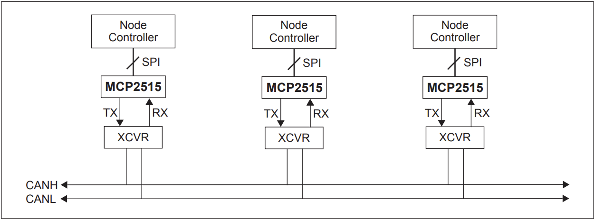

# Overview
The Controller Area Network uses two data lines (CAN_HI and CAN_LO) to send data as a differential signal. This protocol is effective for high-noise environment and long distances, hence the use of this protocol in the OBD scanner.

# System Implementation

The above diagram shows how a typical CAN system works. 

# Data Frame

