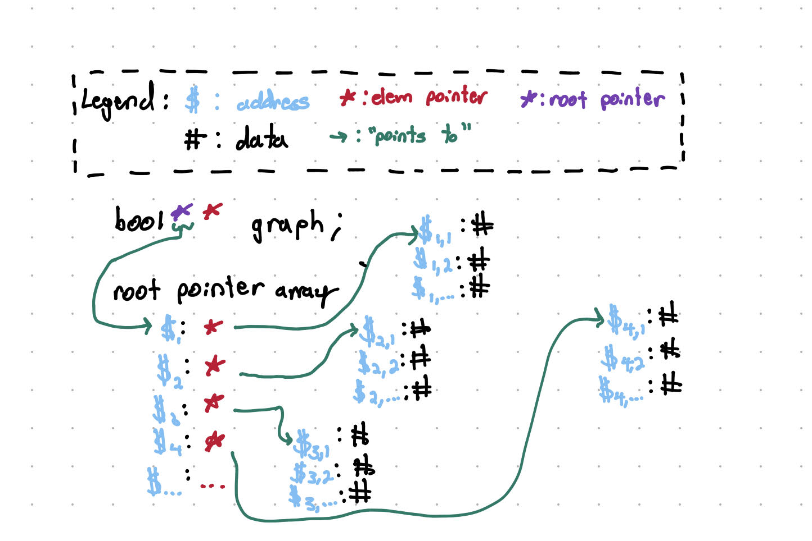
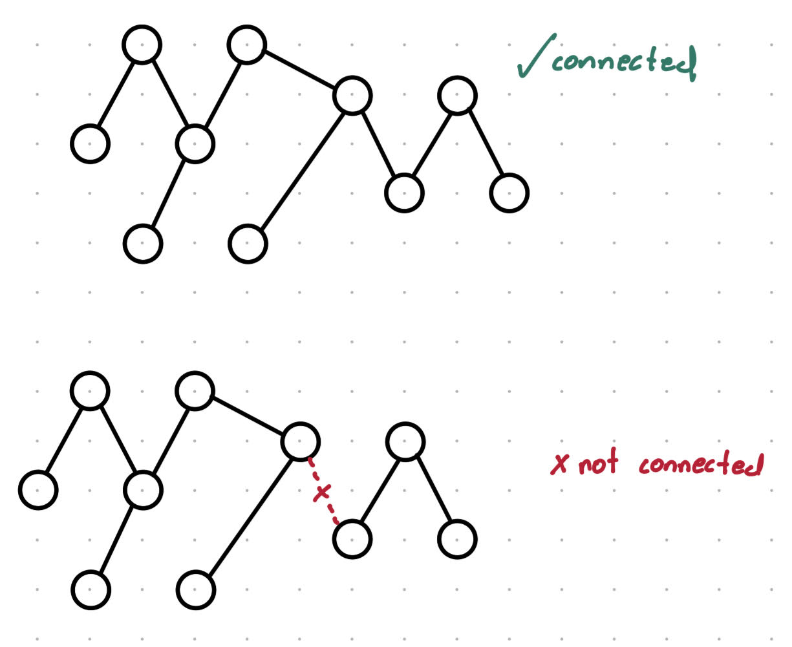

# Overview

Implementing the Dijkstra's algorithm requires some complex knowledge of dynamic arrays and heap allocation.

Because of this, we well run by how each part of the final program works.

# Creating Random Graph

We can think of a graph as two parts...

1. Graphs Nodes
2. Adjacency Matrix

Lets tackle the adjacency matrix first.

## Adjacency Matrix

### Initializing the Matrix

The adjacency matrix is a matrix that shows if there is a connection between two or more nodes.

So if graph[1][3] == 1, there is a connection between nodes 1 and 3. 

In order to implement this, we need to accomplish...

1. Create a dynamic 2D array (So that we can adjust the amount of nodes)
2. Populate the array with boolean values 

Lets take a look at how we can create a dynamic 2D array. (If you are someone familiar with the STL containers, you may know that using vectors will save a lot of headaches, but that's no fun... lets do it without vectors).

```cpp
// Create Adjacency Matrix

bool** graph; // Declare root pointer array
srand(time(0)); // seed rand()
graph = new bool* [size]; // Assign pointer array to root

for(int i = 0; i < size; ++i)
{
    graph[i] = new bool[size]; // Assign child arrays
}
return 0;
```
The above code can be found in ["GenerateRandomGraph.cpp"](GenerateRandomGraph.cpp)

We define a dynamic 2D array called "graph", when it comes to dynamic arrays, remember that we want to define them by using a pointer to point to where we want the array to begin.

We can extend this further by using a double pointer... by using a double pointer, we can point to a root array that contains pointers to other arrays. Think of the root pointer array as the x-axis and the pointers in the x-axis pointing to the set of elements in the y-axis. 



So, the first line initializes the root pointer array, but what about the array of elements (we can think of this as the child array if the root array is the parent)

Let's take a look at the for loop...

```cpp
for(int i = 0; i < size; ++i)
{
    graph[i] = new bool[size];
}
```

Remember that in order to allocate to the head, you need to have a pointer type variable in order to tell the compiler where to allocate to in the heap

```cpp
int* pointer = new intToHeap;
```

Since each element in the graph array is a pointer, we can simply iterate through the graph's element and allocate a bool array to the heap.

### Populating the Array

After we have made the adjacency matrix, we need to populate the matrix (i.e. add the edges).

Let's get an idea of what kind graph we wanna make. We want our graph to be...

1. Undirected
2. Simple (not loops)

```cpp
for(int i = 0; i < size; ++i)
{
    for(int j = 0; j < size; ++j)
    {
        if(i == j)graph[i][j] = false;
        else graph[i][j] = graph[j][i] = (rand() % 100 < .19);
    }
}
```

When we say we want an "undirected" graph, what we mean in the context of our code is that if we have a connection between 1 and 2, there must also be a connection between 2 and 1. More specifically, we need both (1, 2) and (2, 1) in our adjacency matrix. 
Next, we want a simple grpah which is straightforward... all we need is to make sure there are no connections between (1, 1), (2, 2), (3, 3), (4, 4)... i.e., make sure the diagonals of the matrix are false. 

The implementation of these characteristics is straightforward and is shown in the code above. Additionally, we need to make sure that we can vary the density of the graph just so we don't work with the same graph over and over. To accomodate for this, we use the random number generator to make a probability function such that we put in an edge based on a set probability.

Now we have a way to generate a graph, however, we need a way to make sure the graph is connected.

### Is-Connected Algorithm

Since we added probability in how we put in an edge, there is a change we get a disconnected graph. 



In fact, in order to have a good chance for a graph to come out connected, we need a large amount of nodes. If we don't want to work around that constraint, we will need to implement an algorithm that checks if the graph is connected before using the Dijkstra's algorithm.

Lets sort out the details of this algorithm...

1. The program must start with node 0, and determines which nodes can be reached from this node

2. Each node will be placed in the open set.

3. Each iteration will add one node to the closed set.

4. The algorithm will stop once no further nodes are reachable (is_connected will return false) or all nodes get included in the closed set (is_connected will return true).

We will approach this using a BFS (Breadth-First Search)