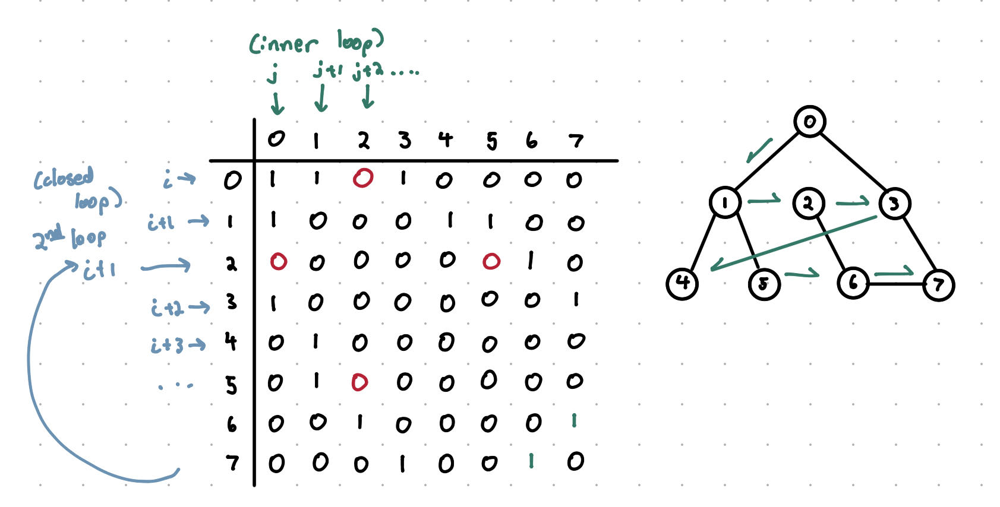

# Overview

Implementing the Dijkstra's algorithm requires some complex knowledge of dynamic arrays and heap allocation.

Because of this, we well run by how each part of the final program works.

# Creating Random Graph

We can think of a graph as two parts...

1. Graphs Nodes
2. Adjacency Matrix

Lets tackle the adjacency matrix first.

## Adjacency Matrix

### Initializing the Matrix

The adjacency matrix is a matrix that shows if there is a connection between two or more nodes.

So if graph[1][3] == 1, there is a connection between nodes 1 and 3. 

In order to implement this, we need to accomplish...

1. Create a dynamic 2D array (So that we can adjust the amount of nodes)
2. Populate the array with boolean values 

Lets take a look at how we can create a dynamic 2D array. (If you are someone familiar with the STL containers, you may know that using vectors will save a lot of headaches, but that's no fun... lets do it without vectors).

```cpp
// Create Adjacency Matrix

bool** graph; // Declare root pointer array
srand(time(0)); // seed rand()
graph = new bool* [size]; // Assign pointer array to root

for(int i = 0; i < size; ++i)
{
    graph[i] = new bool[size]; // Assign child arrays
}
return 0;
```
The above code can be found in ["GenerateRandomGraph.cpp"](GenerateRandomGraph.cpp)

We define a dynamic 2D array called "graph", when it comes to dynamic arrays, remember that we want to define them by using a pointer to point to where we want the array to begin.

We can extend this further by using a double pointer... by using a double pointer, we can point to a root array that contains pointers to other arrays. Think of the root pointer array as the x-axis and the pointers in the x-axis pointing to the set of elements in the y-axis. 


So, the first line initializes the root pointer array, but what about the array of elements (we can think of this as the child array if the root array is the parent)

Let's take a look at the for loop...

```cpp
for(int i = 0; i < size; ++i)
{
    graph[i] = new bool[size];
}
```

Remember that in order to allocate to the head, you need to have a pointer type variable in order to tell the compiler where to allocate to in the heap

```cpp
int* pointer = new intToHeap;
```

Since each element in the graph array is a pointer, we can simply iterate through the graph's element and allocate a bool array to the heap.

### Populating the Array

After we have made the adjacency matrix, we need to populate the matrix (i.e. add the edges).

Let's get an idea of what kind graph we wanna make. We want our graph to be...

1. Undirected
2. Simple (not loops)

```cpp
for(int i = 0; i < size; ++i)
{
    for(int j = 0; j < size; ++j)
    {
        if(i == j)graph[i][j] = false;
        else graph[i][j] = graph[j][i] = (rand() % 100 < .19);
    }
}
```

When we say we want an "undirected" graph, what we mean in the context of our code is that if we have a connection between 1 and 2, there must also be a connection between 2 and 1. More specifically, we need both (1, 2) and (2, 1) in our adjacency matrix. 
Next, we want a simple grpah which is straightforward... all we need is to make sure there are no connections between (1, 1), (2, 2), (3, 3), (4, 4)... i.e., make sure the diagonals of the matrix are false. 

The implementation of these characteristics is straightforward and is shown in the code above. Additionally, we need to make sure that we can vary the density of the graph just so we don't work with the same graph over and over. To accomodate for this, we use the random number generator to make a probability function such that we put in an edge based on a set probability.

Now we have a way to generate a graph, however, we need a way to make sure the graph is connected.

### Is-Connected Algorithm

Since we added probability in how we put in an edge, there is a change we get a disconnected graph. 


In fact, in order to have a good chance for a graph to come out connected, we need a large amount of nodes. If we don't want to work around that constraint, we will need to implement an algorithm that checks if the graph is connected before using the Dijkstra's algorithm.

Lets sort out the details of this algorithm...

1. The program must start with node 0, and determines which nodes can be reached from this node

2. Each node will be placed in the open set.

3. Each iteration will add one node to the closed set.

4. The algorithm will stop once no further nodes are reachable (is_connected will return false) or all nodes get included in the closed set (is_connected will return true).

We will approach this using a [BFS](../CS_Fundamentals/Algorithms/Graph_Algs/Breadth_First_Search/) (Breadth-First Search) algorithm.

To make this easier, let's consider an example graph and adjacency matrix.


Before diving into the matrix, lets examine how we can use BFS to determine that a graph is connected given a picture of the graph.

1. We start at node 0 and examine it's connected nodes (that'd be 1, 2, and 3).

2. Next, we move on to the next node, which would be node 1. Repeat step 1.

3. Move to the next node: Node 2. Repeat step 1.

4. Continue this process, keeping track of every node you visit.

5. If you were able to visit every node, you have a connected graph.

Now, we can examine how we instruct the compiler to follow this same process, but first, we need to clarify an important concept: Open and Closed Sets

Open and Closed sets (aka qeueue and dequeue) are how we keep track of the nodes that we have visited (a concept that will show up a lot in graph traversal). If we visit a node, we place that node into the closed set to indicate that we have already visited that node and don't need to go back to it (dequeue) whereas the open set contains the nodes that are connected to our current node, i.e. the nodes we will examine at some point (queue).

```cpp
bool is_connected(bool* graph[], int size)
{
    int old_size = 0, c_size = 0;
    bool* close = new bool[size];
    bool* open = new bool[size];
    for(int i = 0; i < size; ++i) open[i] = close[i] = false;
    open[0] = true;

    while(c_size < size)
    {
        for(int i = 0; i < size; ++i)
        {
            old_size = c_size;
            if(open[i] && !close[i]) 
            {
                close[i] = true; c_size++;the closed set
                for(int j = 0; j < size; ++j) open[j] |= graph[i][j]; 
            }
            if(c_size == size) return true;
            if(old_size == c_size) return false;
        }
    }
}
```
<ins>**Initializations:**</ins> 

We start by initializing old_size and c_size, which both indicate the size of the closed set.

We know that if a graph is connected, the resulting size of the closed set (c_size) will be equal to the size of the graph itself. However, if a graph is disconnected, this will not be the case.

By making the incrementation of c_size conditional, we can say the graph is disconnected if c_size remains the same as the old_size

Next, we initialize our closed and open set to keep track of which nodes we've visited and have yet to visit.

Finally, we populate our sets to false, keeping the starting node (0) true.

<ins>**Algorithm:**</ins>

Since we need to traverse the graph until c_size == size, we put the function in a while loop

The first for loop will be reponsible for setting the node we are to examine and then examining it:

```cpp 
old_size = c_size; 
```
Sets up the fail condition of the function
```cpp
if(open[i] && !close[i]){} 
```
Make sure the node we are on is not in the closed set AND is in the open set.
```cpp
close[i] = true;c_size++; 
```
Put the node we are on in the close set and increment the size of the closed set.
```cpp
for(int j = 0; j < size; ++j) open[j] |= graph[i][j]; 
```
Examine every other... if it is connected to the node we are on, put it in the open set.
Repeat process.

With that, we have our algorithm!

NOTE: This only works with undirected grpahs. We are working under the assumption that graph[i][j] == graph[j][i], if this were not the case, then open[j == 2] would not imply open[i == 2].

<ins>**Special Cases:**</ins>



This case is why we have a loop reset. On the first run though, the alg will skip over node 2 and continue traversal. After the for loop finishes, node 2 will not be in the closed loop even though the graph is connected.

We will explore how to edit the algorithm to accomodate for this in the future.


This case is a disconnected graph. When the outer loop reaches a disconnected node, the node will be skipped (not put into the open set). Because the node is in no way connected to the starting node, it will never go into the open set.

# Implement Dijkstra's Algorithm

Let's walk through how Dijkstra's Alg works on paper...


In the above grpah, we have our distances to each node which alare shown in blue while the arrows in green show the direction we traverse in our algorithm. 

We prioritize the shortest distance nodes or traversal so 